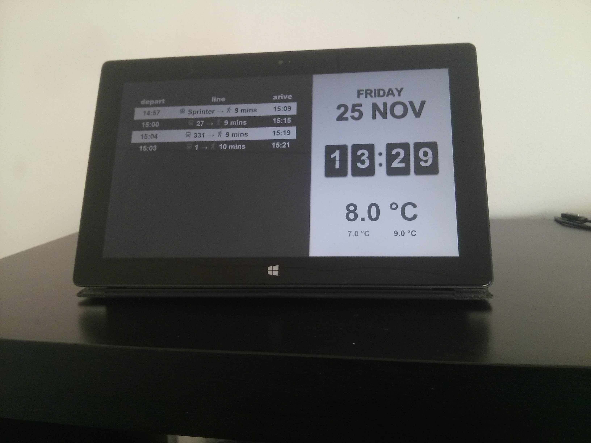

# condor_signage

I'm recycling my old broken tablet (named `elcondor`, dont ask) as a digital sign.
The touchscreen is broken, and I need:

-   a nice clock
-   weather display
-   bus schedule display

## The setup

The touchscreen doesn't work; and its windows 8-RT, so I can only install apps from the windows store (without hacking the OS). Therefore I opted to go for a website, which is deployed straight from the github repo, using [rawgit](https://rawgit.com/Mercotui/condor_signage/master/index.html).
I deployed the website on the tablet, pic related: 

## Technical

An explanation of design decisions and used APIs.

### Weather

I used [openweathermap.org](https://openweathermap.org) to source the weather data.
You can request a free API key, and paste it in condor_signage's interface which the
site stores in your `localStorage`. The location for the weather data is customizable,
by providing a [location ID](http://openweathermap.org/current#cityid) which is also stored in `localStorage`.

### Transit

Using googles maps javascript API, the transit directions are requested between 2
customizable points. Again, an API key has to be provided, and can be requested on
[developers.google.com/maps](https://developers.google.com/maps/documentation/javascript).
The origin and destination of the transit should be provided in the form of a
[google placeId](https://developers.google.com/places/place-id).

### UI

I'm going to be honest, I find user interfaces very difficult.
I'm content with the current aesthetic, but it probably doesn't scale to anything other
than the `elcondor` tablet. Improvements could be made here, like proper scaling on
elements, setting bounds on the scripts (so it doesn't run of the screen with routes)
and more, but i have no plans to do so.
